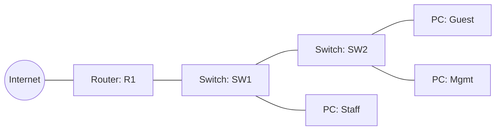

## Overview

This project simulates a small office network that started flat — every device on one broadcast
domain — and needed to be segmented for security and manageability. I split the network into
three VLANs (Staff, Guest, and Management), configured trunking between switches, and set up
router-on-a-stick to allow controlled routing between segments.

The goal was to practice the exact workflow CCNA candidates are expected to know cold: plan the
addressing scheme, configure VLANs and trunks, verify Layer 2 connectivity, then bring up Layer 3
routing between segments.

## Objectives

- Design an IP addressing scheme for three VLANs using VLSM
- Configure VLANs and assign access ports on two switches
- Configure an 802.1Q trunk between the switches
- Configure router-on-a-stick (sub-interfaces) for inter-VLAN routing
- Verify end-to-end connectivity and document every command used

## Topology



<Callout type="info" title="Addressing plan">
VLAN 10 (Staff) — 192.168.10.0/24 · VLAN 20 (Guest) — 192.168.20.0/24 · VLAN 99 (Management) —
192.168.99.0/24. All three route through R1's sub-interfaces on Gi0/0.
</Callout>

## Configuration

Switch-side VLAN and trunk configuration on SW1:

```text
SW1(config)# vlan 10
SW1(config-vlan)# name STAFF
SW1(config-vlan)# vlan 20
SW1(config-vlan)# name GUEST
SW1(config-vlan)# vlan 99
SW1(config-vlan)# name MGMT
SW1(config-vlan)# interface range fa0/1-2
SW1(config-if-range)# switchport mode access
SW1(config-if-range)# switchport access vlan 10
SW1(config-if-range)# interface gi0/1
SW1(config-if)# switchport mode trunk
SW1(config-if)# switchport trunk allowed vlan 10,20,99
```

Router-on-a-stick sub-interfaces on R1:

```text
R1(config)# interface gi0/0.10
R1(config-subif)# encapsulation dot1Q 10
R1(config-subif)# ip address 192.168.10.1 255.255.255.0
R1(config)# interface gi0/0.20
R1(config-subif)# encapsulation dot1Q 20
R1(config-subif)# ip address 192.168.20.1 255.255.255.0
```

## Verification

<CommandBlock title="verification" commands={["show vlan brief", "show interfaces trunk", "show ip route", "ping 192.168.20.10"]} />

Expected result: each VLAN's default gateway responds, hosts within the same VLAN can reach each
other directly, and hosts in different VLANs route through R1. All four checks passed after the
second configuration pass (see Troubleshooting below).

## Troubleshooting

The first attempt failed silently — PCs on VLAN 20 couldn't reach their gateway. `show vlan brief`
showed the access port was still in VLAN 1 because I'd applied `switchport access vlan 20` on the
wrong interface range. Re-checking `show run interface fa0/3` against my plan caught the mismatch
immediately, which is now the first thing I check before escalating any "no connectivity" issue.

## Lessons Learned

- `show vlan brief` and `show interfaces trunk` are the two fastest sanity checks for VLAN issues
- Sub-interfaces need `encapsulation dot1Q <vlan>` configured *before* the IP address will take
- Documenting the addressing plan before touching the CLI saved more time than it cost
